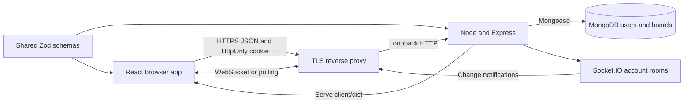
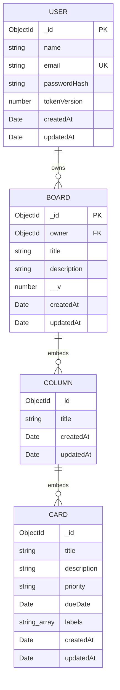
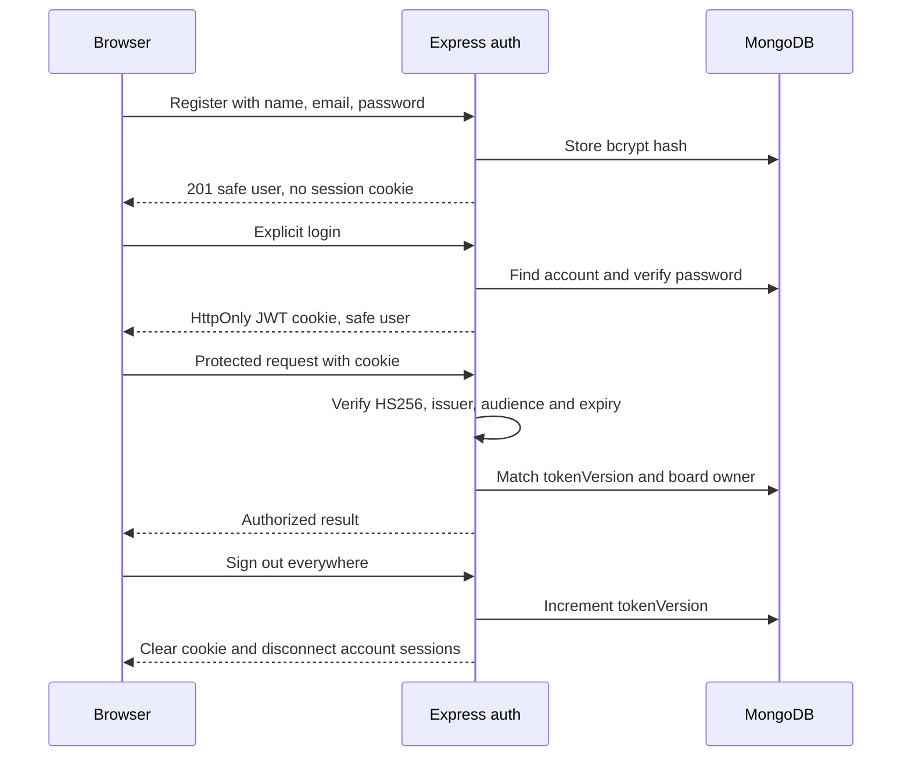
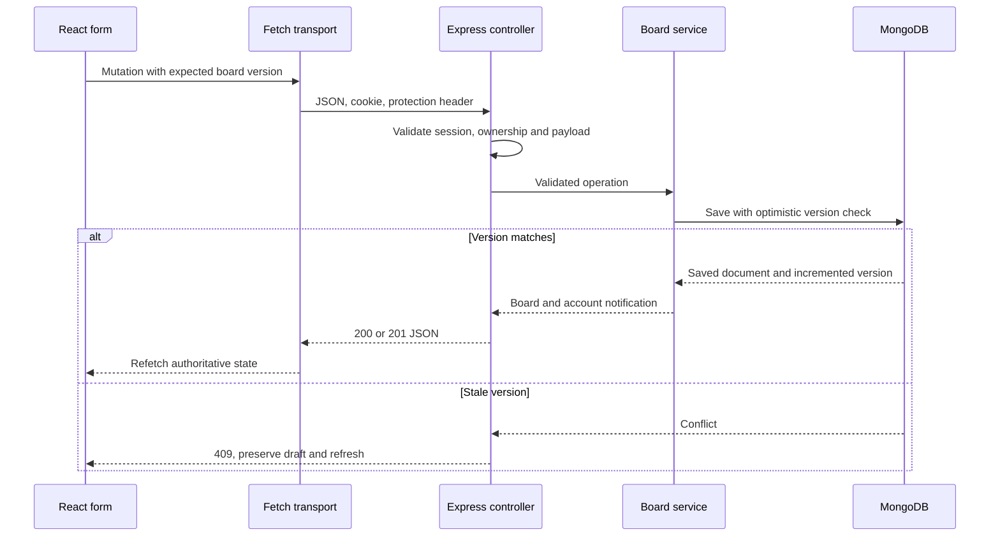
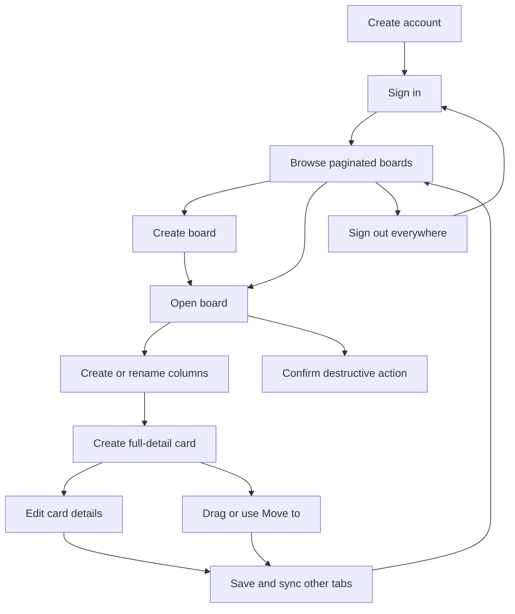

# Flowboard architecture

## Purpose and scope

Flowboard is a private Kanban task manager. A signed-in user creates boards, organizes columns, and creates, edits, moves, and deletes cards with descriptions, priorities, due dates, and labels. Other tabs belonging to the same account receive live notifications.

The maintained application is `flowboard-mern/`. The older sibling `project/` is a different application and is not part of this runtime. This app has no uploads, billing, calculations, administrator role, workspace memberships, or team sharing. Account ownership is the authorization boundary. TypeScript and Docker are intentionally absent.

## System and deployment

Development uses Vite on 5173, proxying `/api` and `/socket.io` to Express on 4001. Production can serve the Vite build directly from Express behind an HTTPS reverse proxy. The server connects to MongoDB and builds indexes before accepting requests. `/api/health` checks process liveness; `/api/ready` checks MongoDB availability.

## Technology and important files

- `client/src/main.jsx`: React root, error boundary, browser router and providers.
- `client/src/routes/`: login/register, protected boards and board details, root redirect and 404 page.
- `client/src/features/auth/`: session API and Context. Registration does not sign in. Session restoration is cancellable and guards against stale responses.
- `client/src/features/boards/`: typed-at-runtime API payloads, Context state, full card form, composition and drag-and-drop. All source is JavaScript/JSX.
- `client/src/services/http.js`: cookie transport, CSRF protection header, 15-second deadline, error normalization and session revision guard.
- `client/src/pages/`: forms, paginated board dashboard, board actions and missing-page handling.
- `server/src/app.js`: HTTP/socket composition, exact-origin policy, Helmet, JSON/cookie middleware and route mounting.
- `server/src/config/`: environment validation and bounded MongoDB connection/query settings.
- `server/src/modules/auth/`: registration, bcrypt password checking, session issuance and revocation.
- `server/src/modules/boards/`: routes/controllers, owner-scoped service, embedded model and validation exports.
- `server/src/modules/users/`: account model and explicit safe response projection.
- `server/src/middleware/`: authentication, authentication rate limiting, public error mapping and static frontend hosting.
- `shared/`: Zod schemas and priority constants consumed directly by both workspaces.
- `scripts/`: setup, syntax checks, source-to-guide generation and disposable browser testing.
- `server/tests/`, `client/tests/`, `shared/tests/`: API, socket, UI and validation regression tests.

MongoDB provides durable storage; Mongoose enforces document rules and optimistic concurrency. Express exposes REST endpoints. React Context manages sessions and board state without Redux. Fetch sends API requests. Socket.IO signals when to refetch; it is not a second database. `@hello-pangea/dnd` supplies pointer and keyboard card movement. Vite builds the client; Node runs server/shared JavaScript directly.

## Data model

Only `users` and `boards` are MongoDB collections. Columns and cards are embedded subdocuments. Array order is display order; a move modifies one board in one optimistic save. No transaction or separate card-position collection is required.

Rules:

- Users: name 1–80 trimmed characters; normalized, unique email up to 254 characters; bcrypt hash excluded from normal reads; token version excluded from normal reads. Password input is at least 8 characters and at most 72 UTF-8 bytes.
- Boards: immutable required owner reference, title 1–120 characters, description up to 2,000, at most 30 columns and 500 cards in total.
- Columns: title 1–80 characters, card array and timestamps.
- Cards: title 1–160 characters, description up to 5,000; priority `low`, `medium`, `high`, or `urgent`; ISO timestamp or null due date; at most 10 nonblank labels of at most 32 characters. New date-picker values use UTC midnight; editing an unchanged date preserves an existing full timestamp.
- Indexes: unique user email; board `{ owner: 1, updatedAt: -1, _id: -1 }` supports the dashboard's deterministic order.
- MongoDB does not enforce a foreign key for `owner`; all application creates derive it from the authenticated user. There is no account-deletion endpoint.

## Authentication and authorization

JWTs last one hour. Production uses the Secure, HttpOnly, SameSite=Lax `__Host-flowboard` cookie at `/`; development uses `flowboard`. Tokens never enter localStorage. All mutations require JSON and `X-Flowboard-Request: 1`. Browser origins must exactly match `CLIENT_ORIGIN`. CLI requests without Origin still require valid authentication and the protection header.

Every board, column and card operation first loads a board by both `_id` and authenticated owner. An absent or another account's board returns the same 404. Strict input schemas reject attempts to assign an owner or unknown fields. Registration/login are limited to 30 attempts per client IP per 15 minutes, using only explicitly trusted proxy addresses.

Sockets verify the cookie, join a separate revocation room, revalidate the session, then join a notification room. Logout disconnects the revocation room, including connections still being verified. `session:ready` signals that notification subscription is ready. Board notifications contain only a board ID and go to the owner's notification room.

## Request and state flow

The board Context serializes local writes and reconciles after success, conflict, or an ambiguous network failure. Read requests cancel superseded reads and use sequence guards. Live events refresh the selected board only when its ID matches. Focus, reconnect, and a 60-second fallback refresh recover missed events. Rejected socket handshakes retry with a bounded delay.

An edit draft retains its starting version. If live data changes while it is open, save is disabled and the draft stays visible for copying/review. Cancel and reopen to edit the latest version. A drag retains its starting layout and version until drop or cancel. Concurrent changes therefore result in conflict rather than overwriting another action.

## API contract

All endpoints start with `/api`. JSON errors use `{ "error": "Readable message" }`; readiness failure uses `{ "status": "unavailable" }`.

- `GET /health`: liveness, 200.
- `GET /ready`: MongoDB readiness, 200 or 503.
- `POST /auth/register`: `{ name, email, password }` → 201 `{ user }`, no login.
- `POST /auth/login`: `{ email, password }` → 200 `{ user }` and cookie.
- `GET /auth/me`: 200 `{ user }` for a valid session.
- `POST /auth/logout`: `{}` → 204 and revokes every account session.
- `GET /boards?page=1&limit=24`: `{ boards, page, pages, total }`. Maximum limit 100, page 1–10000, out-of-range pages clamp to the last page. Summaries exclude columns.
- `POST /boards`: `{ title, description? }` → 201 `{ board }` with To do, In progress and Done.
- `GET /boards/:boardId`: `{ board }` including columns and cards.
- `PATCH /boards/:boardId`: `{ version, title?, description? }` → `{ board }`.
- `DELETE /boards/:boardId`: `{ version }` → 204, including all embedded contents.
- `GET /boards/:boardId/columns`: `{ columns }`; `GET` with `/:columnId`: `{ column }`.
- `POST /boards/:boardId/columns`: `{ version, title }` → 201 `{ board }`.
- `PATCH /boards/:boardId/columns/:columnId`: `{ version, title }` → `{ board }`.
- `DELETE /boards/:boardId/columns/:columnId`: `{ version }` → `{ board }`.
- `GET /boards/:boardId/columns/:columnId/cards`: `{ cards }`; `GET` with `/:cardId`: `{ card }`.
- `POST` on the cards collection: `{ version, title, description?, priority?, dueDate?, labels? }` → 201 `{ board }`.
- `PATCH` on a card: `{ version, ...changedFields }` → `{ board }`.
- `DELETE` on a card: `{ version }` → `{ board }`.
- `POST /boards/:boardId/cards/:cardId/move`: `{ version, sourceColumnId, targetColumnId, targetIndex }` → `{ board }`. Target index is measured after removing the card from its old location.

Common errors: 400 invalid input/ID/JSON, 401 missing/expired/revoked session, 403 origin/protection failure, 404 inaccessible resource, 409 duplicate email or stale version, 413 oversized body, 415 unsupported content type, 429 authentication throttle, 503 database outage. Client-side timeout uses status 408 locally; it does not mean the server rolled back a write.

## User workflow

See [deployment](deployment.md), [testing](testing.md), [audit report](audit-report.md), and the generated [complete source guide](../README.md).
